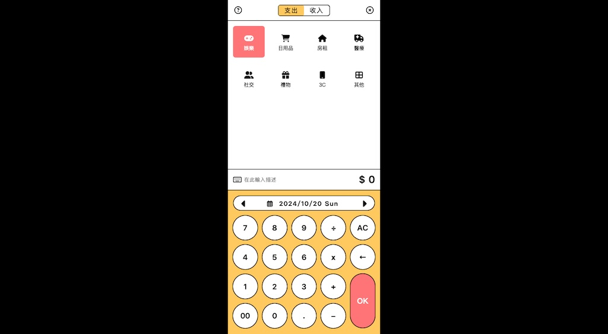
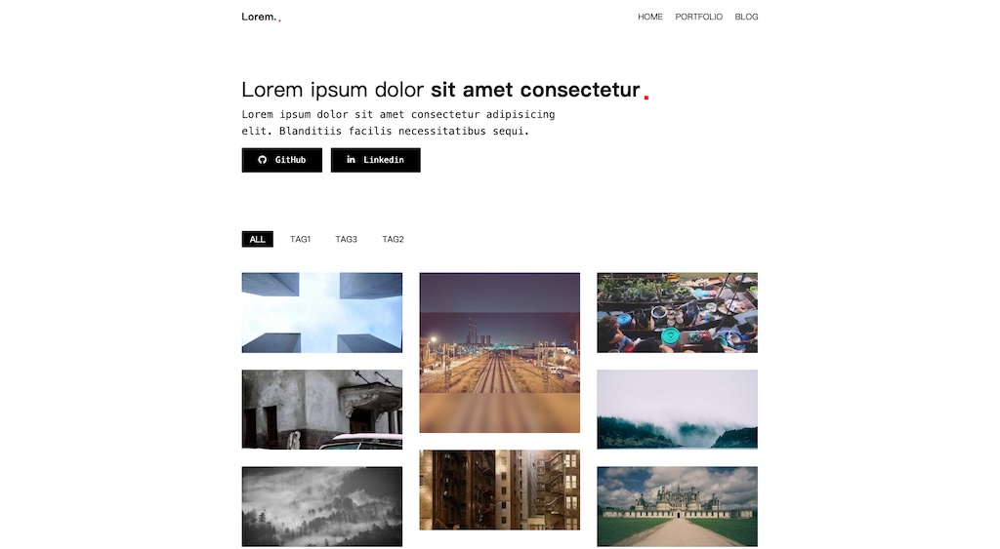
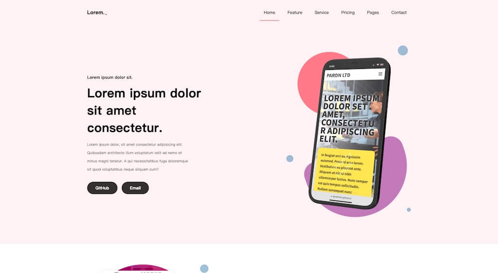

# 統整網站前端範例

  

1. Moneybook 
    製作日期: 2023/04/18
     
2. Personal Page With Blog 
    製作日期: 2023/06/21
    
2. App Introduction 
    製作日期: 2023/07/10
    

## Creator

### 邱敬幃 Pardn Chiu

&nbsp