# 網站前端範例合輯

> 沒有個人設計，只有仿製。
> 唯一有自行設計的項目為 [JOBALL找專家](https://joball.tw)

  

這些範例的代碼包含了 HTML 渲染，純 JS 渲染 
隨著 2023/09 開始輕量化框架 [PDRenderKit](https://github.com/pardnchiu/PDRenderKit) (原 PDExtension) 項目的開發，有修改幾個項目來測試與完善框架 
原本打算花時間全部改寫為 PDRenderKit 渲染，但在過程中又開啟了 [Website Builder](https://github.com/pardnchiu/website-builder) 項目 
因此決定範例改為導入 Website Builder 裡，不會再針對現有的項目進行修改

| 項目 | 項目 |
| - | - |
| Social Networking 製作日期: 2023/07/30 | Minimal Blog 製作日期: 2023/07/23 |
| [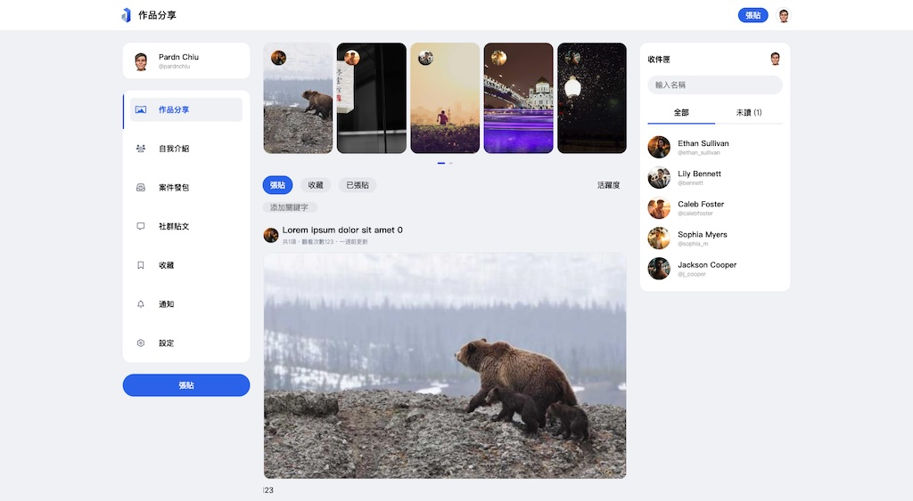](https://pardnchiu.github.io/web-template/target/20230730) | [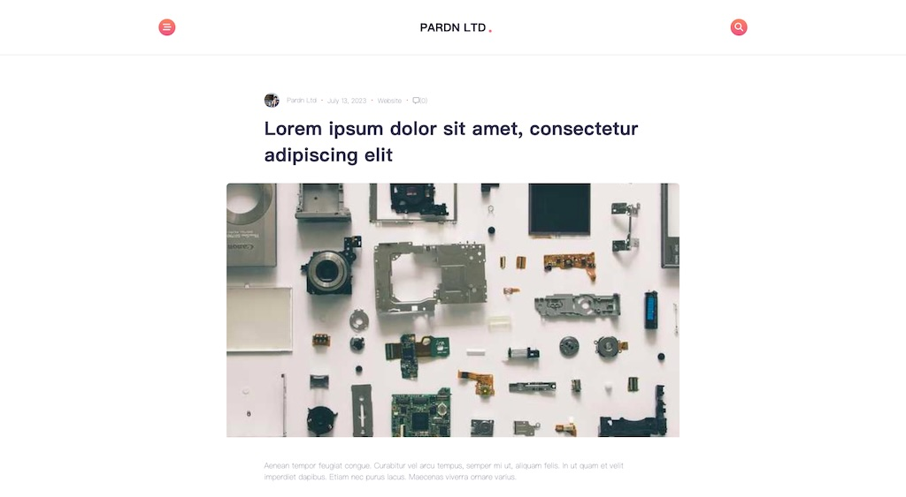](https://pardnchiu.github.io/web-template/target/20230723) |
| Classic Blog 製作日期: 2023/07/22 | Personal Blog with Cover 製作日期: 2023/07/21 | |
| [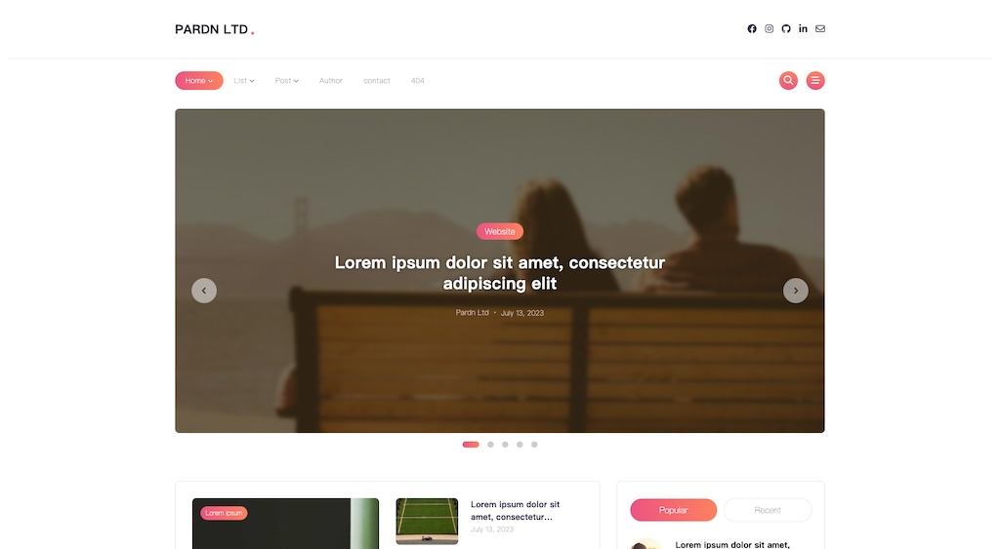](https://pardnchiu.github.io/web-template/target/20230722) | [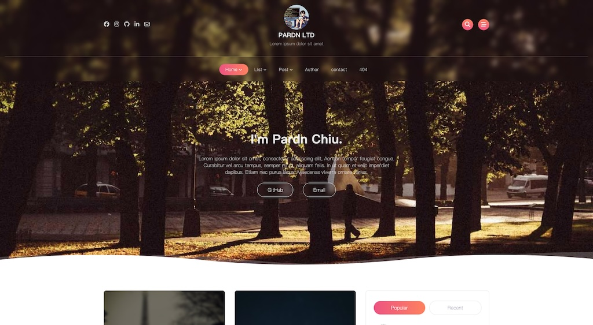](https://pardnchiu.github.io/web-template/target/20230721) |
| Personal Blog 製作日期: 2023/07/20 | Magazine Blog 製作日期: 2023/07/19 最後更新: 2024/08/08 |
| [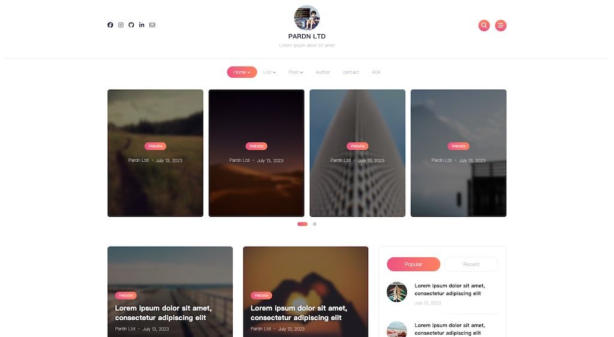](https://pardnchiu.github.io/web-template/target/20230720) | [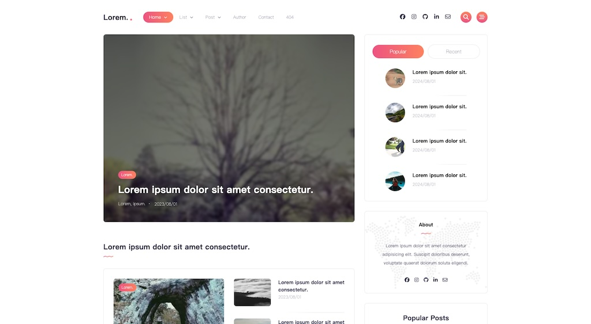](https://pardnchiu.github.io/web-template/target/20230719) |
| Simplify Blog 製作日期: 2023/07/12 | App Introduction 製作日期: 2023/07/10 |
| [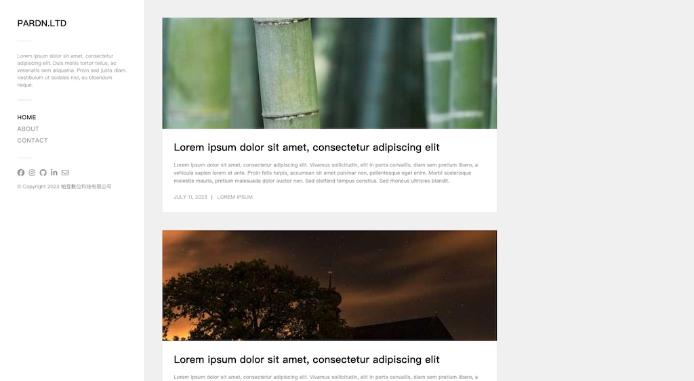](https://pardnchiu.github.io/web-template/target/20230712) |  |
| Personal Page With Blog 製作日期: 2023/06/21 | Gym Introducing 製作日期: 2023/06/19 |
|   |  [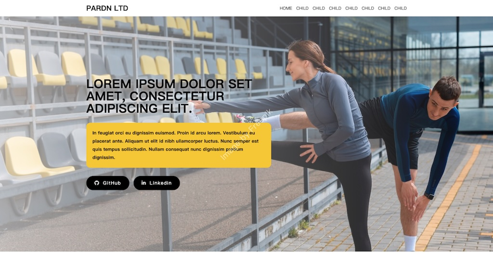](https://pardnchiu.github.io/web-template/target/20230619) |
| Personal Profile 製作日期: 2023/06/16 | About Me Page 製作日期: 2023/06/13 |
| [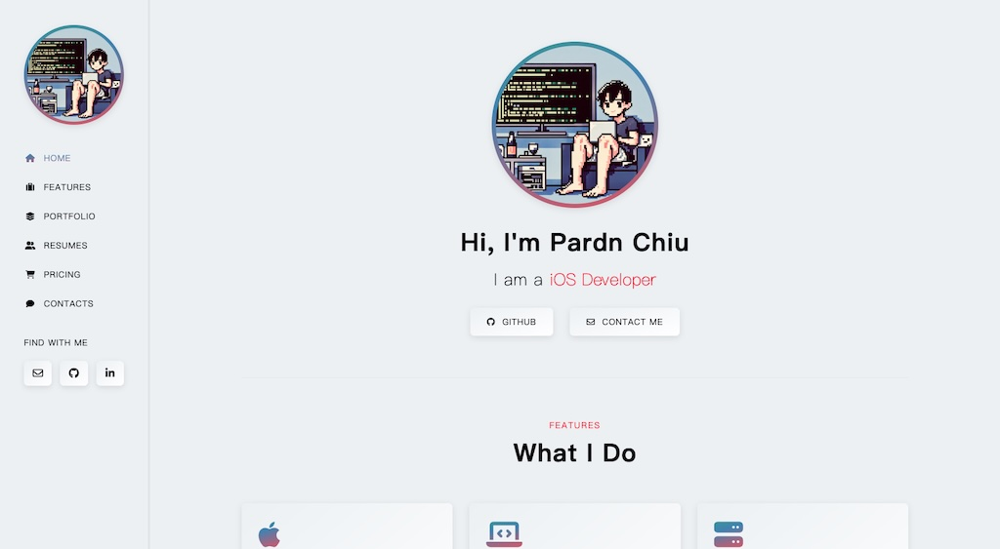](https://pardnchiu.github.io/web-template/target/20230616) | [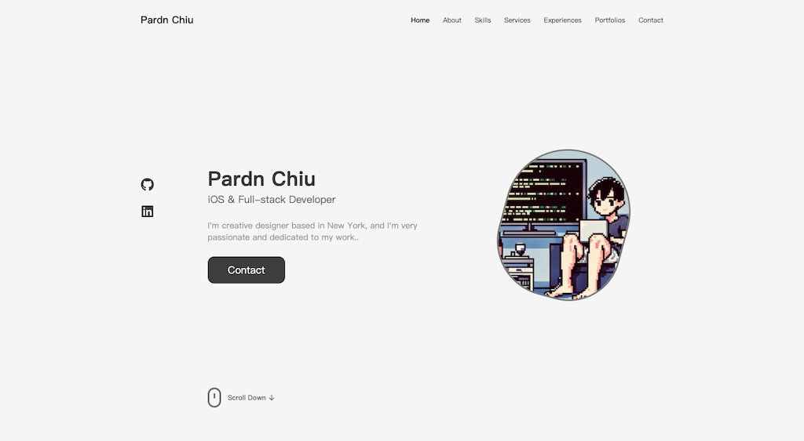](https://pardnchiu.github.io/web-template/target/20230613) |
| Restaurant Introduction 製作日期: 2023/06/04 | Moneybook 製作日期: 2023/04/18 |
| [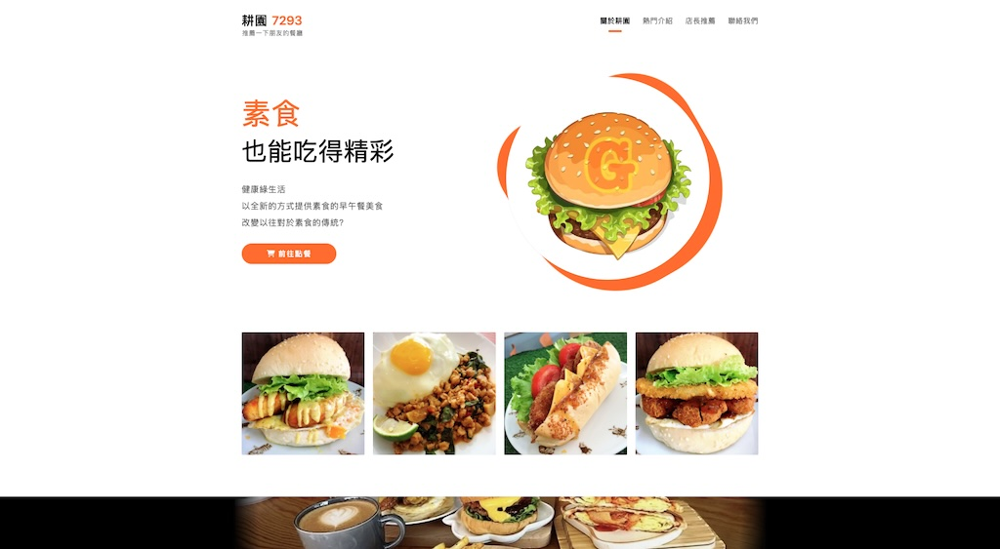](https://pardnchiu.github.io/web-template/target/20230604) |  |
| Personal Introduction 製作日期: 2023/02/20 | Instagram (202210) 製作日期: 2022/10/12 |
| [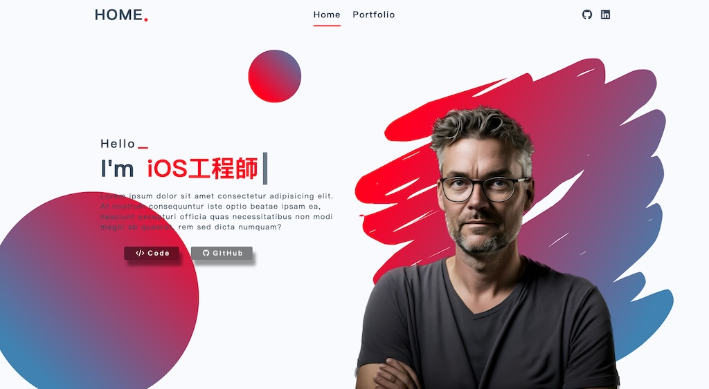](https://pardnchiu.github.io/web-template/target/20230220) |  |

## Creator

<h4 style="padding-top: 0">邱敬幃 Pardn Chiu</h4>

  