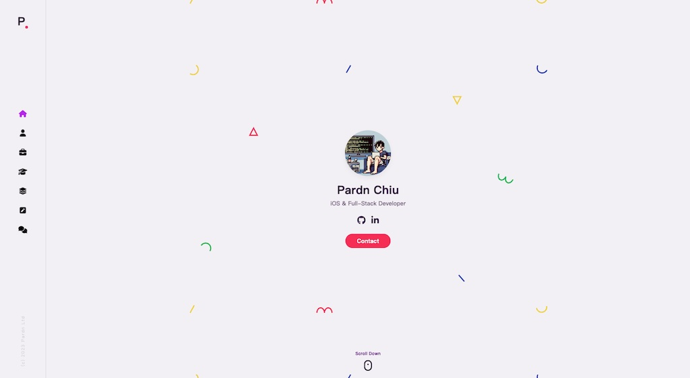
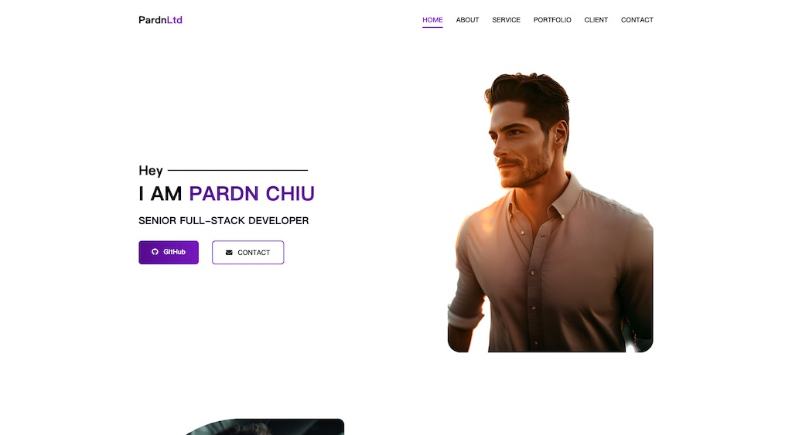
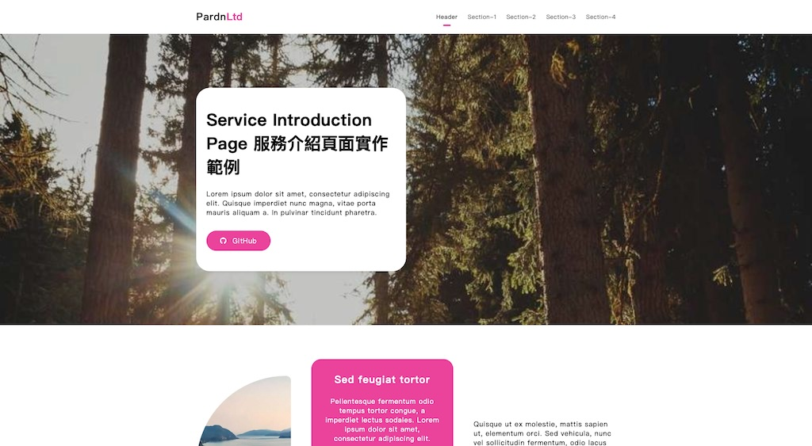
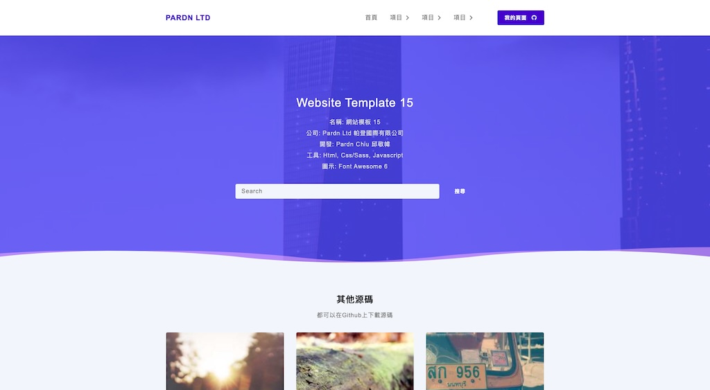
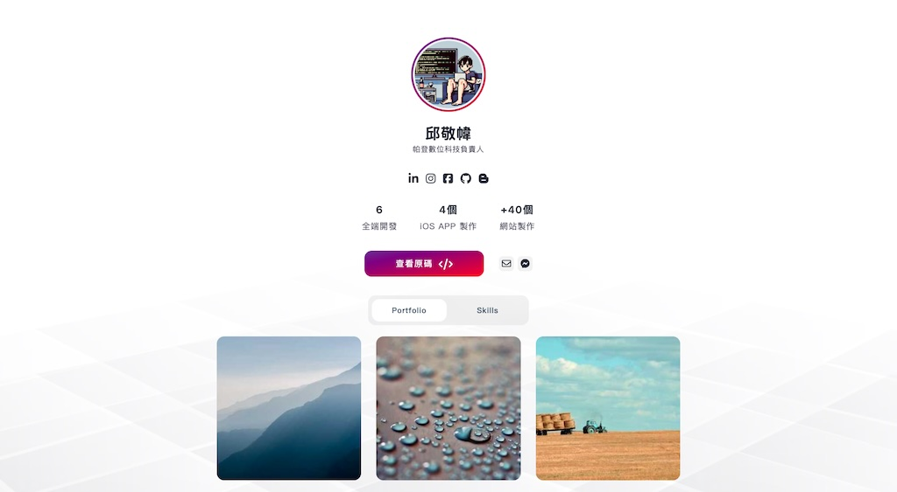
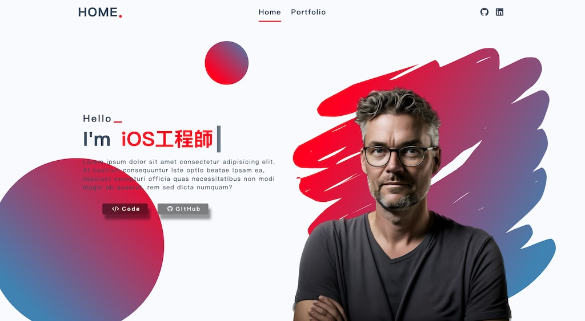
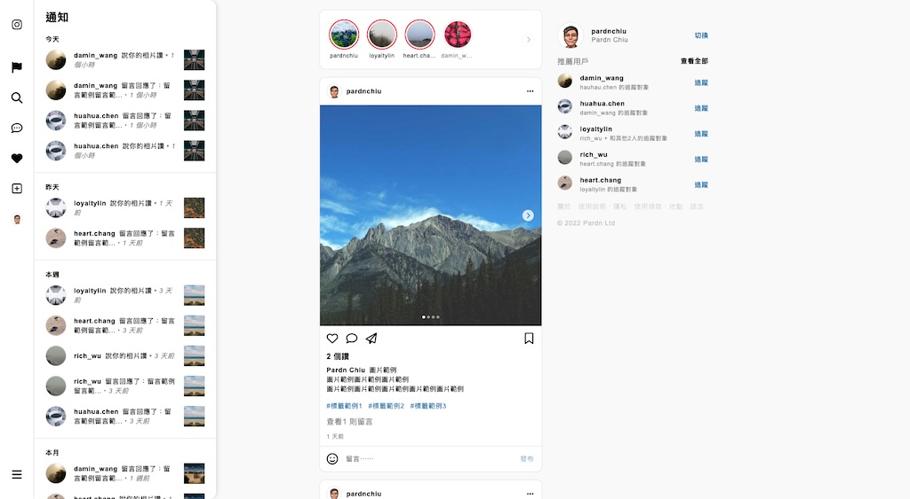
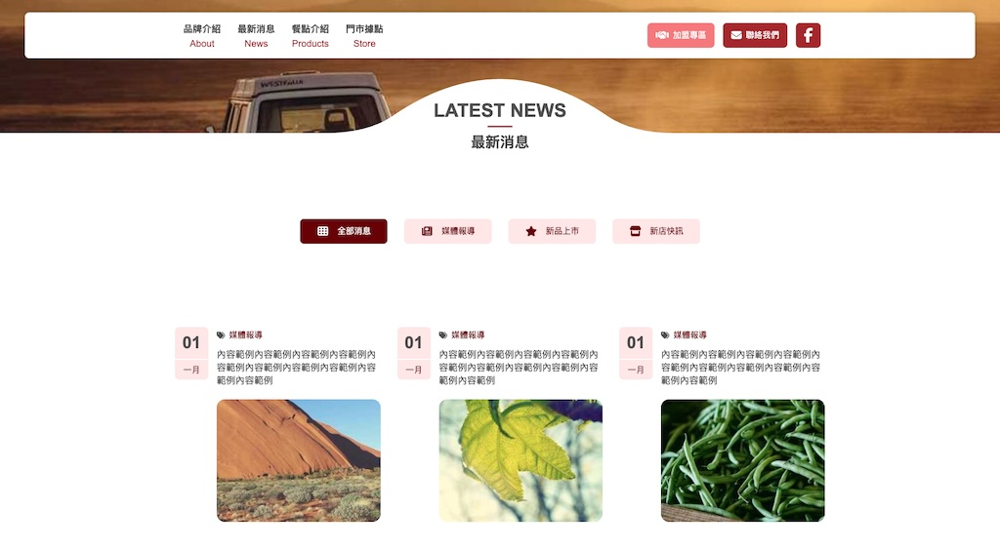
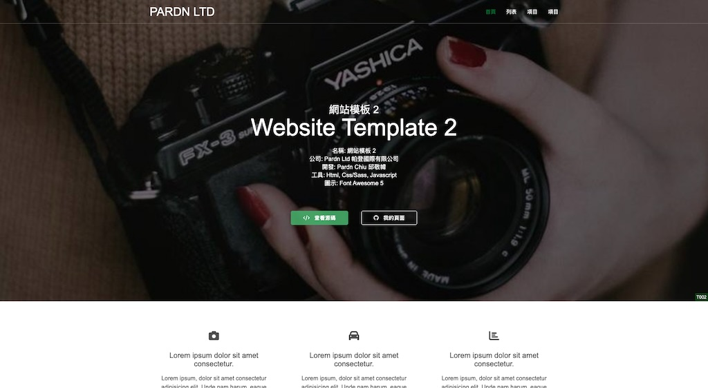
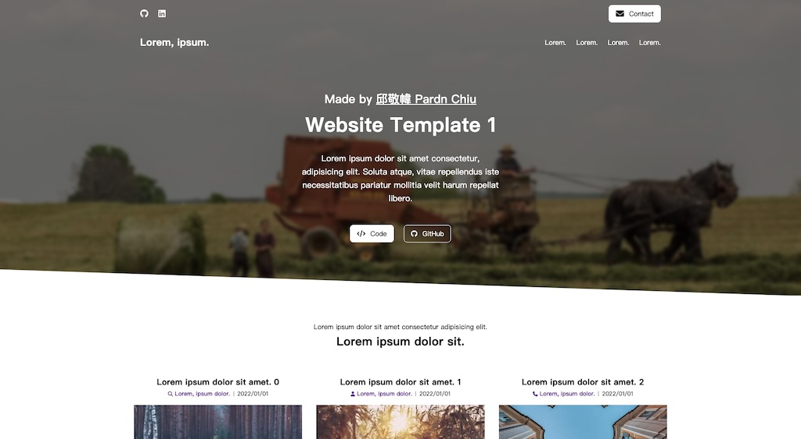

# 網站前端範例合輯

> 沒有個人設計，只有仿製。
> 唯一有自行設計的項目為 [JOBALL找專家](https://joball.tw)

  

這些範例的代碼包含了 HTML 渲染，純 JS 渲染 
隨著 2023/09 開始 [PDRenderKit](https://github.com/pardnchiu/PDRenderKit) (原 PDExtension) 的「輕量化框架」功能開發，有修改幾個項目來測試與完善框架 
原本打算花時間全部改寫為 PDRenderKit 渲染，但在過程中又開啟了 [Website Builder](https://github.com/pardnchiu/website-builder) 項目 
因此決定範例改為導入 Website Builder 裡，不會再針對現有的項目進行修改 

內容授權皆從 GPL3.0 改爲 MIT 
如果對你有一點幫助，可以給個 Star 讓我知道

- #### Social Networking
    製作日期: 2023/07/30
    
- #### Minimal Blog
    製作日期: 2023/07/23
    
- #### Classic Blog
    製作日期: 2023/07/22
    
- #### Personal Blog with Cover
    製作日期: 2023/07/21
    
- #### Personal Blog
    製作日期: 2023/07/20
    
- #### Magazine Blog
    製作日期: 2023/07/19｜<mark>最後更新: 2024/08/08</mark>
    
- #### Simplify Blog
    製作日期: 2023/07/12
    
- #### App Introduction
    製作日期: 2023/07/10
    
- #### Personal Page With Blog
    製作日期: 2023/06/21
    
- #### Gym Introducing
    製作日期: 2023/06/19｜<mark>最後更新: 2024/08/03</mark>
    
- #### Personal Profile
    製作日期: 2023/06/16
    
- #### About Me Page
    製作日期: 2023/06/13
    
- #### Presonal Info
    製作日期: 2023/06/10
    
- #### Personal Page
    製作日期: 2023/06/10
    
- #### Service Introduction
    製作日期: 2023/06/05
    
- #### Restaurant Introduction
    製作日期: 2023/06/04
    
- #### Personal Profile
    製作日期: 2023/05/12
    
- #### Moneybook
    製作日期: 2023/04/18
    
- #### Store Page
    製作日期: 2023/03/14
    
- #### Gallery Page
    製作日期: 2023/03/09
    
- #### Service Info
    製作日期: 2023/03/01
    
- #### Personal Portfolio
    製作日期: 2023/02/26
    
- #### Personal Introduction
    製作日期: 2023/02/20
    
- #### Instagram
    製作日期: 2022/10/12
    
- #### Restaurant Introduction
    製作日期: 2022/05/25
    
- #### Basic
    製作日期: 2022/04/09
    
- #### Basic
    製作日期: 2022/04/08｜<mark>最後更新: 2024/08/03</mark>
     
 
## Creator

<h4 style="padding-top: 0">邱敬幃 Pardn Chiu</h4>

  