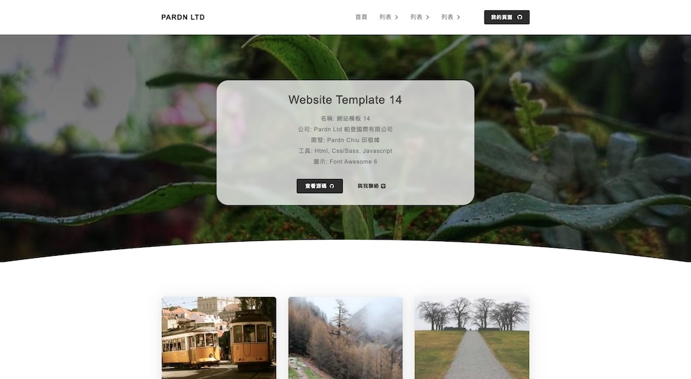
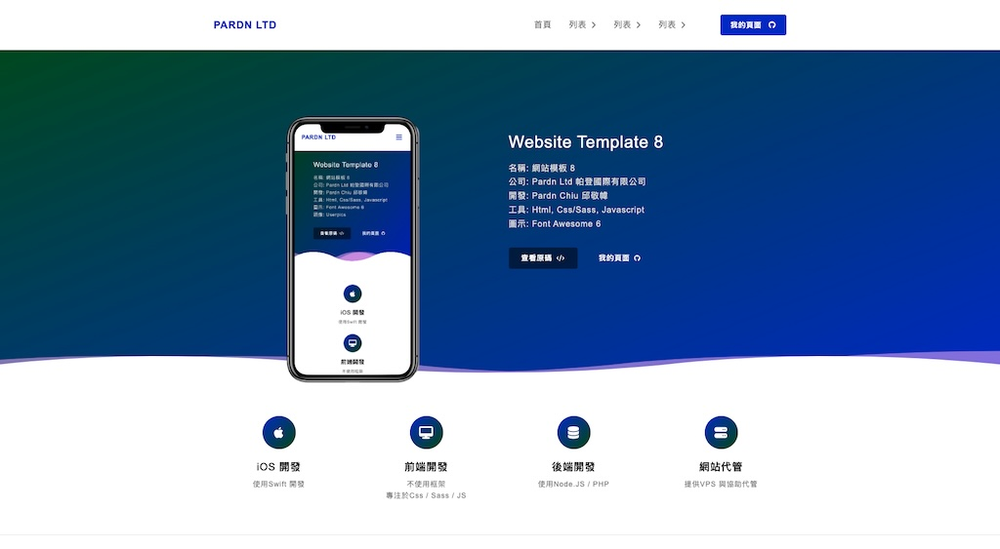

# 網站前端範例合輯

> 沒有個人設計，只有仿製。
> 唯一有自行設計的項目為 [JOBALL找專家](https://joball.tw)

  

這些範例的代碼包含了 HTML 渲染，純 JS 渲染 
隨著 2023/09 開始 [PDRenderKit](https://github.com/pardnchiu/PDRenderKit) (原 PDExtension) 的框架功能開發，有修改幾個項目來測試與完善框架 
原本打算花時間全部改寫為 PDRenderKit 渲染，但在過程中又開啟了 [Website Builder](https://github.com/pardnchiu/website-builder) 項目 
因此決定範例改為導入 Website Builder 裡，不會再針對現有的項目進行修改 
並且授權皆從 GPL3.0 改爲 MIT 
如果對你有一點幫助，可以給個 ★ Star 讓我知道

| 項目 | |
| - | - |
|  |  |
| **Zeczec** 製作日期: 2024/06/25 | **Social Networking** 製作日期: 2023/07/30 |
|  |  |
| **Minimal Blog** 製作日期: 2023/07/23 | **Classic Blog** 製作日期: 2023/07/22 |
|  |  |
| **Personal Blog with Cover** 製作日期: 2023/07/21 | **Personal Blog** 製作日期: 2023/07/20 |
|  |  |
| **Magazine Blog** 製作日期: 2023/07/19 <mark>最後更新: 2024/08/08</mark> | **Simplify Blog** 製作日期: 2023/07/12 |
|  |  |
| **App Introduction** 製作日期: 2023/07/10 | **Personal Page With Blog** 製作日期: 2023/06/21 |
|  |  |
| **Gym Introducing** 製作日期: 2023/06/19 <mark>最後更新: 2024/08/03</mark> | **Personal Profile** 製作日期: 2023/06/16 |
|  |  |
| **About Me Page** 製作日期: 2023/06/13 | **Presonal Info** 製作日期: 2023/06/10 |
|  |  |
| **Personal Page** 製作日期: 2023/06/10 | **Service Introduction** 製作日期: 2023/06/05 |
|  |  |
| **Restaurant Introduction** 製作日期: 2023/06/04 | **Personal Profile** 製作日期: 2023/05/12 |
|  |  |
| **Moneybook** 製作日期: 2023/04/18 | **Store Page** 製作日期: 2023/03/14 |
|   | 處理中 |
| **Product Introduction** 製作日期: 2023/03/12 | 製作日期: 2023/03/11 |
| 處理中 |  |
| 製作日期: 2023/03/10 | **Gallery Page** 製作日期: 2023/03/09 |
| 處理中 |  |
| 製作日期: 2023/03/06 | **App Introduction** 製作日期: 2023/03/02 |
|  |  |
| **Service Info** 製作日期: 2023/03/01 | **Personal Portfolio** 製作日期: 2023/02/26 |
|  |  |
| **Personal Introduction** 製作日期: 2023/02/20 | **Instagram** 製作日期: 2022/10/12 |
| 處理中 |  |
| 製作日期: 2023/06/04 | **Restaurant Introduction** 製作日期: 2022/05/25 |
| 處理中 | 處理中 |
| 製作日期: 2023/04/18 | 製作日期: 2023/04/13 |
| 處理中 |  |
| 製作日期: 2023/04/12 | **Basic** 製作日期: 2022/04/09 |
|  ||
| **Basic** 製作日期: 2022/04/08 <mark>最後更新: 2024/08/03</mark> ||
 
## Creator

<h4 style="padding-top: 0">邱敬幃 Pardn Chiu</h4>

  